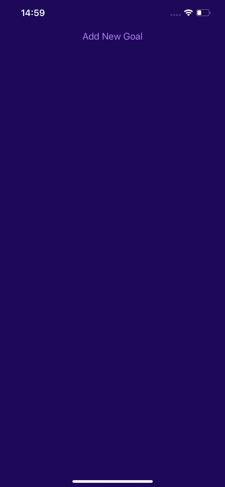

# List of Goals

My first mobile app project - a simple goal tracking application built with React Native and Expo.

## Features

- **Add Goals**: Create new goals through a modal interface
- **Delete Goals**: Tap on any goal to remove it from the list
- **Modal Interface**: Clean slide-up modal for goal input
- **Responsive Design**: Touch feedback with ripple effects on Android

## Screenshots

### Android
| Home Screen | Add Goal Modal | Goal List |
|-------------|----------------|-----------|
|  |  |  |

### iOS
| Home Screen | Add Goal Modal | Goal List |
|-------------|----------------|-----------|
|  |  |  |

## Components Built

### App.js (Main Component)
- **useState**: Managing modal visibility and goals array state
- **FlatList**: Efficiently rendering the list of goals with built-in scrolling
- **Button**: Simple "Add New Goal" trigger button
- **StatusBar**: From Expo, set to light style for better UI consistency

### GoalInput Component
- **Modal**: Full-screen slide animation modal for goal input
- **TextInput**: Text input field with placeholder and controlled state
- **Image**: Static goal icon from assets for visual appeal
- **Styled Buttons**: Cancel and Add Goal buttons with custom colors

### GoalItem Component  
- **Pressable**: Used instead of TouchableOpacity for better touch handling
- **android_ripple**: Android-specific ripple effect for native feel
- **Conditional Styling**: iOS pressed state styling for cross-platform consistency

## Technology Stack

- **React Native**: Core framework
- **Expo**: Development platform and StatusBar component
- **React Hooks**: useState for state management
- **JavaScript**: ES6+ features and array methods

## Installation

1. Clone this repository
2. Install dependencies: `npm install`
3. Start Expo: `npx expo start`
4. Run on device/simulator using Expo Go app

## About

This is my first React Native project focusing on fundamental mobile development concepts. The app demonstrates component composition, state management, modal interfaces, and platform-specific styling. Built with Expo for easier development and testing across iOS and Android.
